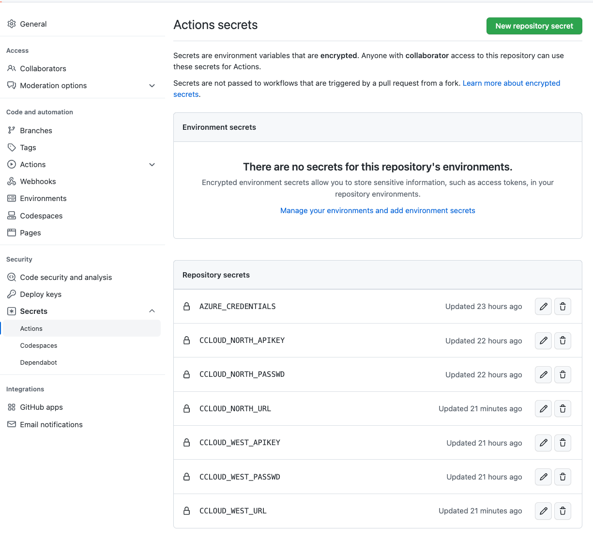
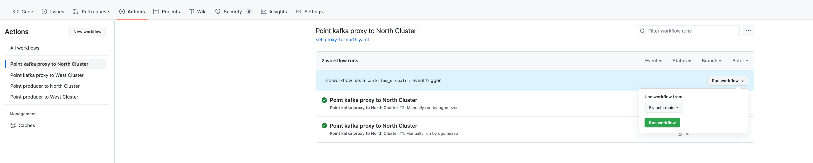
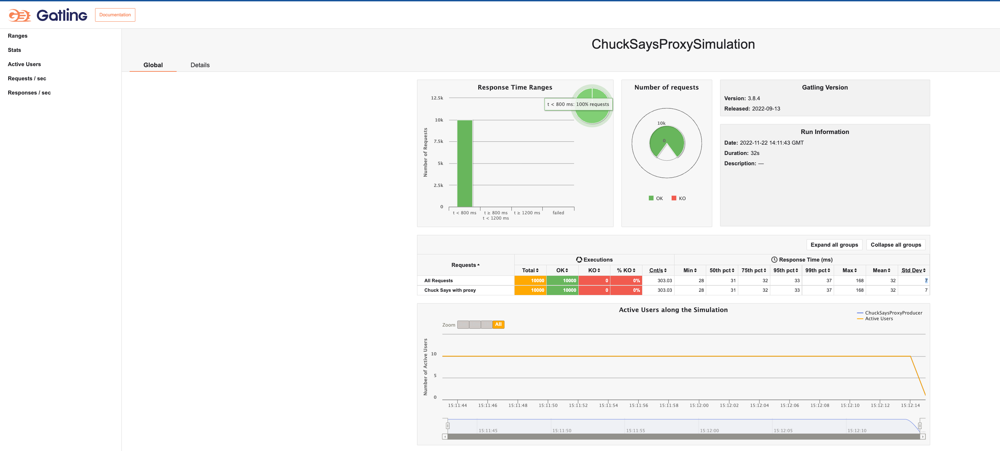

# Disaster Recovery Playgroung

## Project Goal

Reproduce different architectural patterns for Confluent Cluster Disaster Recovery and their failover and failback procedures.

## Active-Active Platform over Confluent Cloud with Clients hosted on K8s Cluster with automatic restart on config changes

### Architectural Design


### Scenario Topology

1. 2 Confluent Cloud Clusters following the active-active DR pattern:

   

2. Kubernetes Cluster deployed (connectivity to CCloud cluster required)

3. [Reloader](https://github.com/stakater/Reloader) pod deployed on your. For standard deployment you can execute:

   ```bash
   kubectl apply -f https://raw.githubusercontent.com/stakater/Reloader/master/deployments/kubernetes/reloader.yaml
   ```

4. Create topics you want to use on both DC if auto.create.topics.enable is false

   5. Cluster Linking: To setup the `active-active DR pattern` you will need:

      1. Create a `.env` file under `ccloud-resources` folder it will contain:

      ```properties
      export ENV=  # CCLOUD Environment you're working on #
      export TOPIC= # Default topic where clients will produce/consume #
      export NP_TOPIC= # Topic where no proxy clients will produce/consume #
      export CCLOUD_NORTH_CLUSTERID= # DC-1 Cluster Id #
      export CCLOUD_NORTH_URL= # DC-1 Bootstrap server #
      export CCLOUD_NORTH_APIKEY= # DC-1 App key #
      export CCLOUD_NORTH_PASSWD= # DC-1 password #
      export CCLOUD_WEST_CLUSTERID= # DC-2 Cluster Id #
      export CCLOUD_WEST_URL= # DC-2 Bootstrap url #
      export CCLOUD_WEST_APIKEY= # DC-2 Api Key #
      export CCLOUD_WEST_PASSWD= # DC-2 Password #
      ```
      * The following scripts will use `.env` file to configure the resource creation
      * All mirror topics will be prefixed with `<DC-Name>-`
      2. Run  `ccloud-resources/cluster-linking/cluster-linking-north-west.sh` to create DC-1 to DC-2 `cluster link`
      3. Run  `ccloud-resources/cluster-linking/create-mirror-topic-north-west.sh` to create the mirror topic on DC2 cluster for proxy based clients
      4. Run `ccloud-resources/cluster-linking/create-mirror-noproxy-topic-north-west.sh` to create the mirror topic for on DC-2 cluster for non proxy based clients
      5. Run `ccloud-resources/cluster-linking/cluster-linking-west-north.sh` to create DC-2 to DC-1 `cluster link`
      6. Run `ccloud-resources/cluster-linking/create-mirror-topic-west-north.sh` to create mirror topic on DC1 for proxy based clients
      7. Run `ccloud-resources/cluster-linking/create-mirror-noproxy-topic-west-north.sh` to create mirror topic on DC1 for non proxy based clients 

6. Java Clients (producer/consumer) images on a available registry (you can use the resource definition provided under k8's resources folder)

   * ConfigMaps/Secrets need to be annotated to make `reloader` aware of the config changes:

      ```yaml
        annotations:
          reloader.stakater.com/match: "true"
      ```

   * Client application `deployment` will be annotated with config maps that we want to actively listen changes:

      ```yaml
        annotations:
          configmap.reloader.stakater.com/reload: "java-cloud-producer-config,kafka-proxy-config"
      ```
    1. **Java Client with Proxy**
        * Resources are intended to be created on a `clients` namespace.
        * Clients will be deployed with a [grepplabs/kafka-proxy](https://github.com/grepplabs/kafka-proxy) container as sidecar, that will act as a layer 7 kafka protocol aware proxy.
       
       1. Create 2 configmap using the file `k8s-resources/proxy/kafka-proxy-configmap.yaml` as a template. For each configmap, add the details of DC Cluster and API Key/Secret. This will be the config map the produce refers when it start:

           ```bash
           kubectl apply -f k8s-resources/proxy/kafka-proxy-configmap.yaml
           ```

       2. Producer using a Proxy
             1. Configure how the producer will call the proxy (as a sidecar):

                ```bash
                kubectl apply -f k8s-resources/proxy/java-cloud-producer-configmap.yaml
                ```

             2. Run the producer:

                ```bash
                kubectl apply -f k8s-resources/proxy/java-cloud-producer.yaml
                ```

             3. Send Messages using the producer:

                Get the EXTERNAL-IP where the producer expose its API:

                ```bash
                kubectl get svc -n clients
                ```

                and send the message using this command:

                ```bash
                curl -X POST http://<EXTERNAL-IP>:8080/chuck-says
                ```
       3. Consumer using Proxy
          1. Apply consumer config:
          
            ````bash
            kubectl apply -f k8s-resources/proxy/java-cloud-consumer-configmap.yaml
            ````
          2. Apply consumer resources:
          
            ```bash
            kubectl apply -f k8s-resources/proxy/java-cloud-consumer.yaml
            ```
          
            * The consumer will consume from a topic group based on pattern that covers the topology described on `active-active pattern`

       3. When disaster happens we will change the `k8s-resources/proxy/kafka-proxy-configmap.yaml` with the values of DC2 Cluster

       4. `Reloader` will trigger a `rolling update` on any deployment annotated to listen changes of this CM.

       5. As failback procedure we just need to restore the connection data on `k8s-resources/proxy/kafka-proxy-configmap.yaml` to the DC 1 values and after a `rolling update` clients will be again connecting to the original cluster.
       
    2. **Java Client without Proxy**
        * Resources are intended to be created on a `nproxy-clients` namespace.

        1. Producer without proxy 
           1. Create a configmap using the file `k8s-resources/no-proxy/java-cloud-producer-noproxy-configmap.yaml as a template. For each configmap, add the details of DC Cluster and API Key/Secret. This will be the config map the produce refers when it start:

                ```bash
                kubectl apply -f k8s-resources/no-proxy/java-cloud-producer-noproxy-configmap.yaml
                ```

           2. Configure how the producer that will call CCloud Cluster directly:

                      ```bash
                      kubectl apply -f k8s-resources/no-proxy/java-cloud-producer-noproxy.yaml
                      ```

           3. Send Messages using the producer:

                      Get the EXTERNAL-IP where the producer expese its API:

                      ```bash
                      kubectl get svc -n noproxy-clients
                      ```

                      and send the message using this command:

                      ```bash
                      curl -X POST http://<EXTERNAL-IP>:8080/chuck-says
                      ```
    
           4. When disaster happens we will change the `k8s-resources/no-proxy/java-cloud-producer-noproxy-configmap.yaml` with the values of DC2 Cluster

           5. `Reloader` will trigger a `rolling update` on any deployment annotated to listen changes of this CM.

           6. As failback procedure we just need to restore the connection data on `k8s-resources/no-proxy/java-cloud-producer-noproxy-configmap.yaml` to the DC 1 values and after a `rolling update` clients will be again connecting to the original cluster.
           
        2. Consumer without proxy
           1. Create a config map using `k8s-resources/no-proxy/java-cloud-consumer-noproxy-configmap.yaml` as template as consumer it will contain the cluster information
              ```bash
              kubectl apply -f k8s-resources/no-proxy/java-cloud-consumer-noproxy.yaml
              ```
           2. Apply the consumer resources:
              ```bash
              kubectl apply -f k8s-resources/no-proxy/java-cloud-consumer.yaml
              ```
           3. `Consumer Client` will be created consumin from a pattern of topics that matches with the `active-active pattern`
              
## Failover/failback automation:

The change of the proper configuration (kafka-proxy or client config) on the subsequent config map is fully automated based `git hub actions`  and `Azure AKS` you can find the actions definition under `.github/workflows` folder.

### Setting up your Repository to run the action:

First thing you will need is get yout `AZURE_CREDENTIALS` by running:

```bash
az ad sp create-for-rbac --name "chuck" --role contributor --scopes /subscriptions/<azure-subscription-id>/resourceGroups/<resource-group> --sdk-auth
```

and set the json response as repository secret on github.

You also will need to setup secrets for the CCLOUD resources config.

Find the secrets needed on the image bellow.



### Running the action:

Just go to the `Actions` tab on your repo choose the action and branch from you want to perform.



For `proxy clients` a change on `proxy configuration` will be enough to change configuration on both `consumer` and `producer` and perform a rolling update.

In case of `no proxy clients` the configuration is change directly on the client so you need to apply on both of them separately.

## Performance Test

A basic performance test suite is implemented using [Gatling](https://gatling.io).

The test will run 1000 request for 10 concurrent users for proxy and no proxy producers

To run it set up `perftest/src/test/resources/application.conf` file with the public endpoints for your proxy and no-proxy clients go to perftest folder and run:

```bash
mvn gatling:test
```

after that you can find the report folders with a `index.html` file under `perftest/target/gatling`


